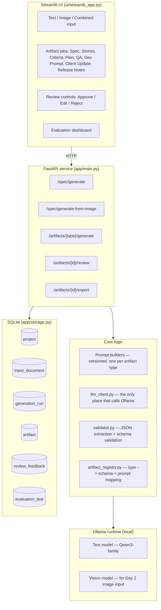
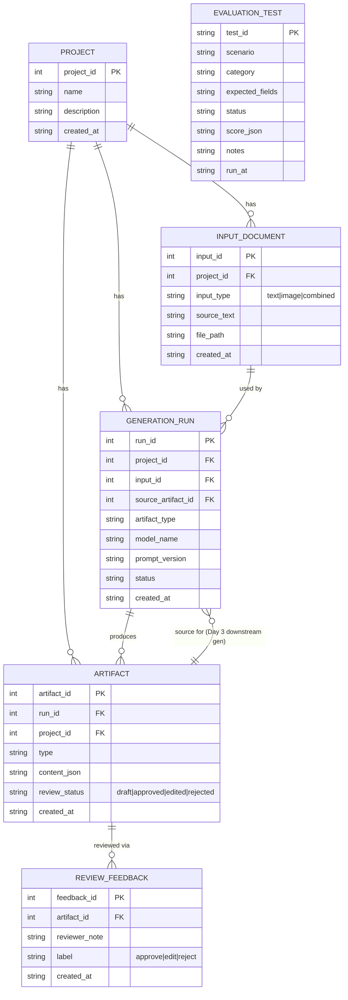

# Architecture, data model, and workflow

These are Mermaid diagrams — GitHub renders them natively in any `.md`
file, no image export needed. If your reviewer wants PNGs, paste each
block into https://mermaid.live and export.

## 1. Logical architecture



## 2. Entity relationship diagram



## 3. End-to-end workflow

```mermaid
sequenceDiagram
    participant U as User
    participant UI as Streamlit UI
    participant API as FastAPI
    participant M as Ollama model
    participant DB as SQLite

    U->>UI: Create project
    UI->>API: POST /projects
    API->>DB: INSERT project
    U->>UI: Paste requirement text (or upload image)
    UI->>API: POST /spec/generate
    API->>DB: INSERT input_document (raw input preserved)
    API->>M: prompt (spec_prompt_v1)
    M-->>API: raw text
    API->>API: extract_json + schema validate
    API->>DB: INSERT generation_run, artifact (status: draft)
    API-->>UI: spec JSON or structured error
    U->>UI: Reviews spec; requests downstream artifact
    UI->>API: POST /artifacts/{type}/generate
    API->>DB: fetch latest approved/draft spec artifact
    API->>M: prompt (artifact-specific, spec as context)
    M-->>API: raw text
    API->>API: extract_json + schema validate
    API->>DB: INSERT generation_run, artifact
    API-->>UI: artifact JSON or structured error
    U->>UI: Approve / Edit / Reject
    UI->>API: POST /artifacts/{id}/review
    API->>DB: UPDATE artifact.review_status, INSERT review_feedback
    U->>UI: Export
    UI->>API: GET /artifacts/{id}/export?format=markdown|json
    API-->>UI: rendered export
```
